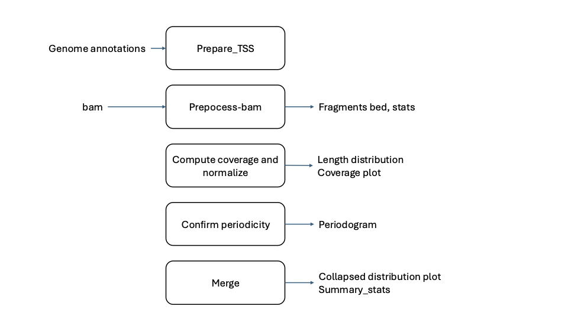
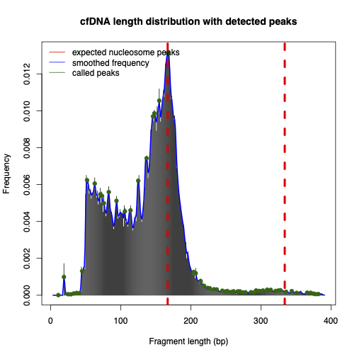
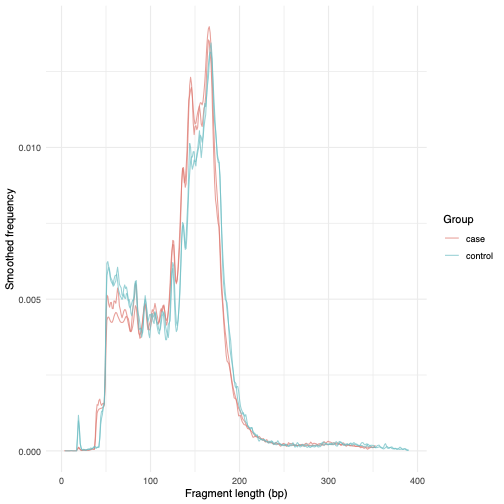
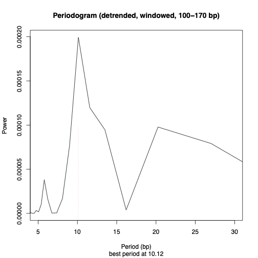

# cfDNA Fragmentomics Pipeline

Command-line pipeline for basic cfDNA fragmentomics analysis, including:

- extracting TSS-centered regions
- preprocessing BAM files into fragment BEDs
- computing coverage and length-frequency profiles
- generating per-sample plots and merged case/control histograms
- running all steps in batch for multiple samples

All steps are wrapped by a single CLI: `bin/cf_frags.py`.



## 1. Installation and requirements

### Dependencies

- Unix-like system (bash)
- Python ≥ 3.6
- R ≥ 4.0
- Common bioinformatics tools (used inside the bash scripts):
  - `samtools`
  - `bedtools`
  - `awk`, `gawk`,`sed`, `grep`, `sort`, `gzip`, etc.

R packages (used in the plotting scripts):

- `ggplot2`
-  `data.table`

### Setup

Clone this repository and make the scripts executable:

```bash
https://github.com/pegahtak/cf_frag.git
cd fragmentomics
```
make the scripts executable:
```bash
chmod +x bin/cf_frags.py
chmod +x bin/get_TSS.sh
chmod +x bin/preprocess_bam.sh
chmod +x bin/compute_coverage.sh
chmod +x bin/merge_plots.sh
chmod +x bin/batch.sh
```

## 2. Directory layout (expected)

layout:

```text
cf_frag/
├── bin/
│   ├── cf_frags.py          # main CLI wrapper
│   ├── get_TSS.sh
│   ├── preprocess_bam.sh
│   ├── compute_coverage.sh
│   ├── merge_plots.sh
│   └── batch.sh
├── scripts/
│   └── merge.R              # R script for plotting and get
│   ├── 04_plot_cov_norm.R
│   ├── periodicity_confirmation.R
│   ├── stats.
│   └── 04_plot_cov_norm.R
├── data/
│   ├── gencode.vXX.annotation.gtf
│   ├── hg38.chrom.sizes
├── results/
│   └── ...                  # created by the pipeline
├── test/
│   └── test_data
└── batch_scripts/
    └── ...  

```


## 3. Input files

### 3.1 Reference files

**Genome files (e.g. GENCODE, hg38)**  

Download the human reference genome annotation from GENCODE and place it in the `data` directory, then unzip it. For example:

```bash
wget https://ftp.ebi.ac.uk/pub/databases/gencode/Gencode_human/release_49/gencode.v49.annotation.gtf.gz -P data/
cd data
gunzip gencode.v49.annotation.gtf.gz
cd ..
```
This produces:
```text
data/gencode.v49.annotation.gtf
```
Download chromosome sizes for the matching human reference (e.g. hg38) and place the file in the data directory, for example:
```text
data/hg38.chrom.sizes
```
### 3.2 Samples files (used for batch mode):
A simple tab separated text file with three columns: sample name, condition, path to the bam file.
```bash
config/samples_file.txt

case1   case    data/case1.bam
ctrl1   control data/ctrl1.bam        
case2   case    data/case2.bam
ctrl2   control data/ctrl2.bam

```
## 4. CLI usage
All commands are operated through `cf_frags.py`:
```bash
bin/cf_frags.py <subcommand> [options]
```
### 4.1 prepare_TSS
This command extracted transcription start points from the genome annotation file and stores them in `data/gene_TSS_point.bed`.
Then it will expand the points 1000bp at both directions `data/gene_TSS_window.bed`. The window size can be changed using `--window` option.
```bash
bin/cf_frags.py prepare_TSS --gtf data/gencode.{version}.annotation.gtf \
--chrom-sizes data/hg38.chrom.sizes \
--outdir data --window {window_size/2}
```
### 4.2 preprocess-bam
Sort and deduplicate/filter BAM files then produces a fragment BED and, a summary for fragment length distributions per sample.
example usage:
```bash
bin/cf_frags.py preprocess-bam \
  --bam /path/to/case1.dedup.bam \
  --sample case1 \
  --min-len 50 \
  --max-len 500 \
  --outdir results/case1

```
`--min-len` and `--max-len` if provided, are used to filter out fragments outside the range.


### 4.3 coverage
Compute coverage and normalized signal around regions using `--upstream-bp` and `--downstream-bp` options (by default 2500).
For each sample, this step generates a summary, normalizes the fragment length
distribution, and computes/plots FFT-based signals to confirm periodicity in the 100–180 bp range.
```bash
bin/cf_frags.py coverage --fragments results/case1/case.bed --regions data/gene_TSS_window.bed \
--sample case1 \
--upstream-bp 2500 --downstream-bp 2500\
--outdir results/case1 \
--chrom-sizes data/hg38.chrom.sizes --len-freq results/case1_length_freq.tsv
```
### 4.4 merge-plots
Collapse normalized frequency histograms across samples and make merged plots (e.g. cases vs controls).
```bash
bin/cf_frags.py merge-plots \
  --sample-file data/sample_files.txt \
  --outdir results\
```
This will produce a histogram `results/histogram_all.pdf` and a summary of fragment length information of all samples `results/stats.tsv`

## 5. Batch mode: full pipeline per sample, in parallel
batch runs, for each sample:
-	`preprocess_bam.sh`
-	`compute_coverage.sh`
in parallel across samples, then calls `merge_plots.sh` once at the end.
```bash
bin/cf_frags.py batch --sample-file config/samples_file.txt \
--regions data/gene_TSS_window.bed \
--upstream-bp 2500 --downstream-bp 2500 \
--chrom-sizes data/hg38.chrom.sizes
```
## test
you can test these commands with some small bam files.
Download sample bam files from https://drive.google.com/drive/folders/1AVm5-fq6yglTLQLgoFXOkHsn-q10yb6Y?usp=sharing
which contains two cancerous and two healthy cfDNA BAM files. Place them them in `test/test_data`. 

Make the manifest file:
```text
case1	case	test/test_data/case1.bam
ctrl1	control	test/test_data/ctrl1.bam	
case2	case	test/test_data/case2.bam
ctrl2	control	test/test_data/ctrl2.bam
```
and save it in `config/test_samples_file.txt`

Finally run the command in the batch mode:
```bash
bin/cf_frags.py batch --sample-file config/test_samples_file.txt \
--regions data/gene_TSS_window.bed \
--upstream-bp 2500 --downstream-bp 2500 \
--chrom-sizes data/hg38.chrom.sizes
```

if everything works, you should see:

A single-sample fragment length distribution with expected mono/di/tri-nucleosome peaks:


Collapsed smoothed length distributions for all samples, grouped by case/control:


A detrended periodogram showing ~10 bp nucleosomal periodicity in the 100–170 bp window:


